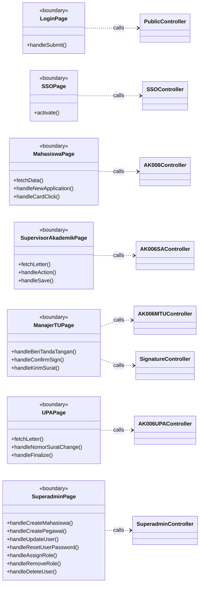
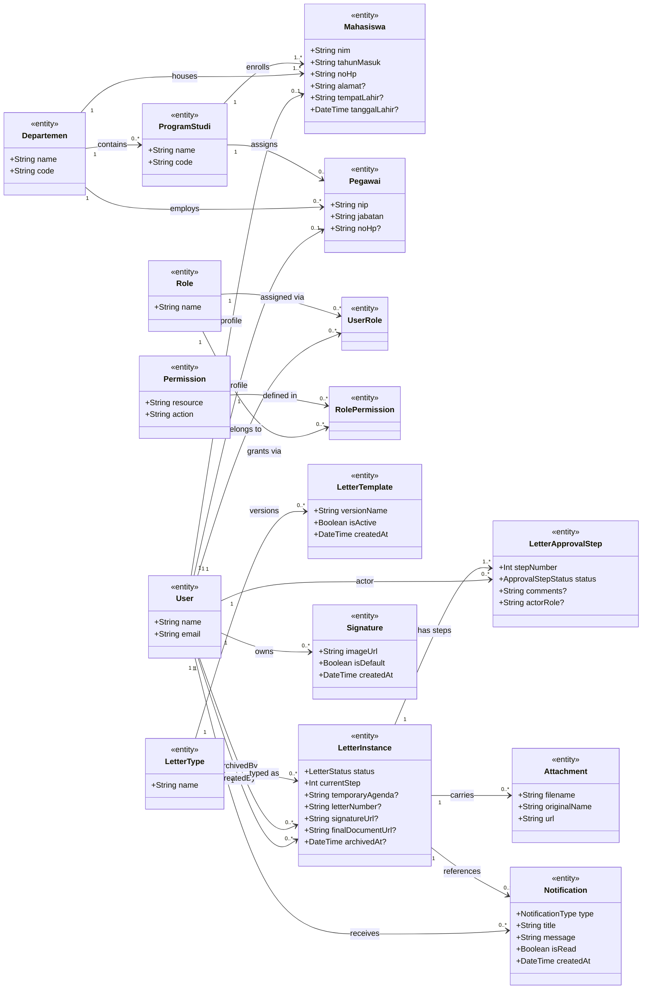
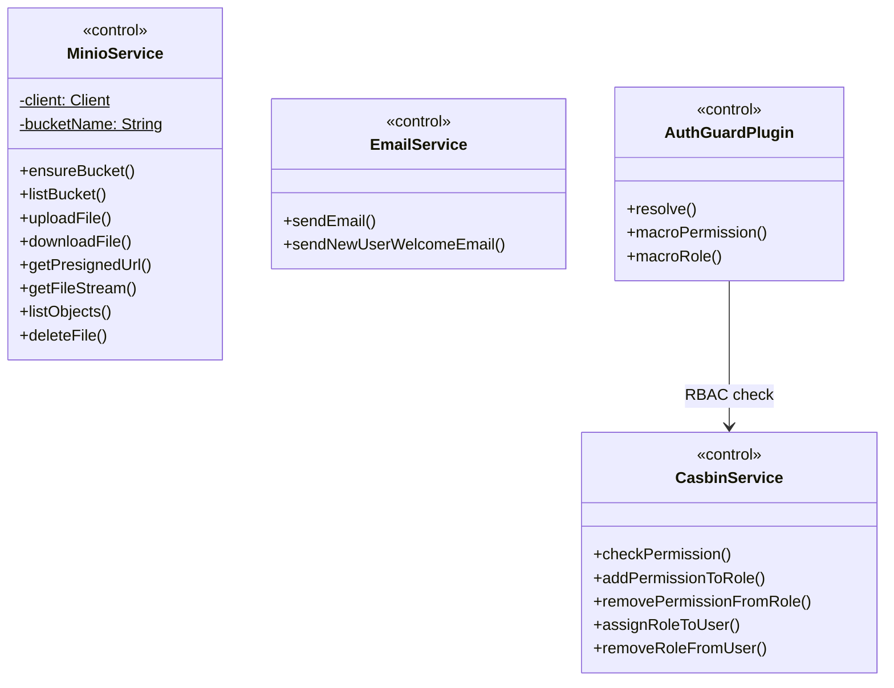
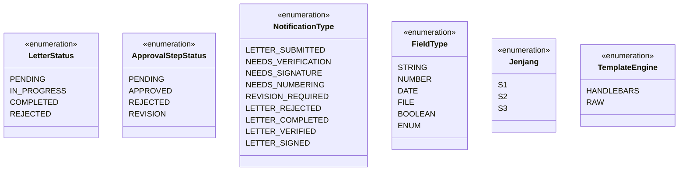

# Class Diagram 2 — E-Office Monorepo (FSM UNDIP)

> Format: **Mermaid** · Pola **BCE (Boundary-Control-Entity)** · Entity hanya atribut, controller langsung akses entity (tanpa service layer)

---

## 1. Boundary Layer (Frontend Pages)

---

## 2. Domain Models (Entity)

---

## 3. Controller Layer (Routes)

```mermaid
classDiagram
direction TB

class SSOController {
  <<control>>
  +handleSSO()
  +redirect()
}

class PublicController {
  <<control>>
  +signIn()
  +register()
}

%% ─── Letter Controllers ───
class AK006Controller {
  <<control>>
  +createLetter()
  +updateLetter()
  +deleteLetter()
}

class AK006SAController {
  <<control>>
  +verifyLetter()
  +updateLetterData()
  +updateStudentData()
}

class AK006MTUController {
  <<control>>
  +signLetter()
  +forwardToUPA()
  +rejectLetter()
  +requestRevision()
}

class AK006UPAController {
  <<control>>
  +finalizeLetter()
}

class SignatureController {
  <<control>>
  +createSignature()
  +setDefaultSignature()
  +deleteSignature()
}

class SuperadminController {
  <<control>>
  +updateLetter()
  +forceApproveLetter()
  +forceRejectLetter()
  +deleteLetter()
  +updateUser()
  +resetUserPassword()
  +assignUserRole()
  +removeUserRole()
  +deleteUser()
  +createMahasiswaUser()
  +createPegawaiUser()
  +updateAK006Template()
  +backfillTemplateConfigs()
  +impersonateUser()
}

class MeController {
  <<control>>
  +completeProfile()
  +changePassword()
}

class NotificationController {
  <<control>>
  +markAsRead()
  +markAllAsRead()
  +deleteNotification()
}

class UploadController {
  <<control>>
  +uploadFile()
}

class MasterCRUDController {
  <<control>>
  +create()
  +update()
  +delete()
}

%% ─── Controller → Entity Dependencies ───
SSOController ..> User : uses
SSOController ..> CasbinService : uses
PublicController ..> User : uses
AK006Controller ..> LetterInstance : uses
AK006Controller ..> Notification : uses
AK006SAController ..> LetterInstance : uses
AK006SAController ..> User : uses
AK006SAController ..> Mahasiswa : uses
AK006SAController ..> Notification : uses
AK006MTUController ..> LetterInstance : uses
AK006MTUController ..> Signature : uses
AK006MTUController ..> Notification : uses
AK006UPAController ..> LetterInstance : uses
AK006UPAController ..> Notification : uses
SignatureController ..> Signature : uses
SuperadminController ..> LetterInstance : uses
SuperadminController ..> User : uses
SuperadminController ..> Notification : uses
SuperadminController ..> EmailService : uses
SuperadminController ..> CasbinService : uses
MeController ..> User : uses
MeController ..> Mahasiswa : uses
MeController ..> Pegawai : uses
NotificationController ..> Notification : uses
UploadController ..> MinioService : uses
UploadController ..> CasbinService : uses
MasterCRUDController ..> User : uses
MasterCRUDController ..> Mahasiswa : uses
MasterCRUDController ..> Pegawai : uses
MasterCRUDController ..> Role : uses
MasterCRUDController ..> Permission : uses
MasterCRUDController ..> Departemen : uses
MasterCRUDController ..> ProgramStudi : uses
MasterCRUDController ..> LetterType : uses
MasterCRUDController ..> LetterTemplate : uses
```

---

## 4. Infrastructure & Auth Layer

---

## 5. Enums

---

## Ringkasan Perbedaan Diagram 1 vs Diagram 2

| | class-diagram.md | classdiagram2.md |
|---|---|---|
| **Entity** | Hanya atribut | Hanya atribut |
| **Service layer** | Ada (terpisah) | Tidak ada |
| **Controller** | Panggil service | Panggil entity langsung |
| **Pola** | MVC dengan service layer | BCE tanpa service layer |
| **Cocok untuk** | Dokumentasi arsitektur nyata | Diagram UML akademik / sequence diagram |
