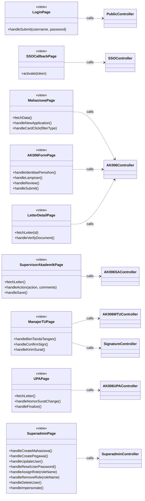
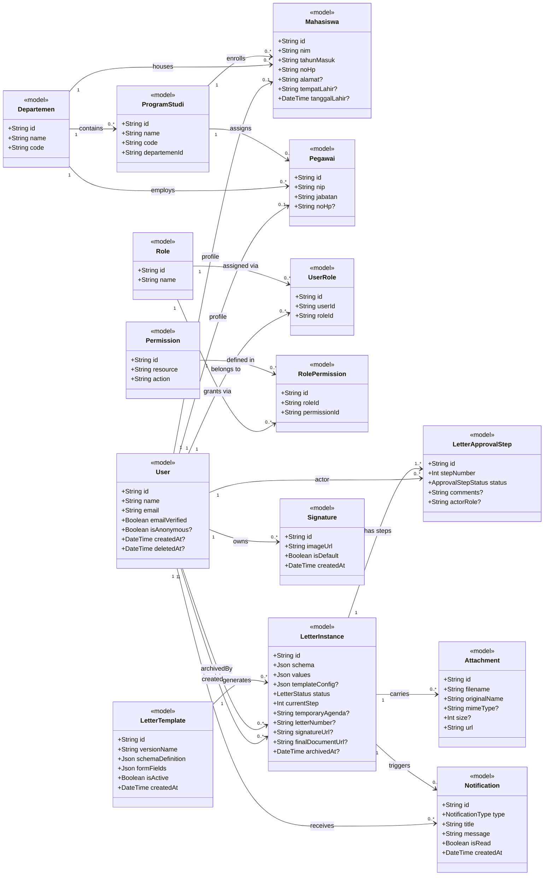
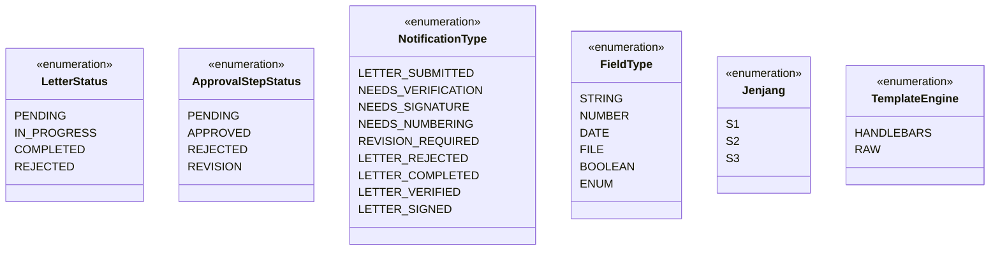

# Class Diagram — E-Office Monorepo (FSM UNDIP)

> Format: **Mermaid** · Pola **MVC (Model-View-Controller)**

---

## 1. View (Frontend Pages)

---

## 2. Controller

```mermaid
classDiagram
direction TB

class PublicController {
  <<controller>>
  +signIn(username, password)
  +register(name, username, password)
}

class SSOController {
  <<controller>>
  +handleSSO(token)
  +assignRoleToUser(userId, role)
}

class AK006Controller {
  <<controller>>
  +getMyLetters(user)
  +getLetter(id)
  +getTimeline(id)
  +createLetter(body, user)
  +updateLetter(id, body, user)
  +deleteLetter(id, user)
}

class LetterBaseController {
  <<controller>>
  +getPendingLetters()
  +getProcessedLetters()
  +getLetter(id)
  +getTimeline(id)
}

class AK006SAController {
  <<controller>>
  +verifyLetter(id, action, comments)
  +updateLetterData(id, body)
  +updateStudentData(id, body)
}

class AK006MTUController {
  <<controller>>
  +signLetter(id, body)
  +forwardToUPA(id, comments)
  +rejectLetter(id, comments)
  +requestRevision(id, comments, targetStep)
}

class AK006UPAController {
  <<controller>>
  +getArchivedLetters()
  +finalizeLetter(id, body)
  +rejectLetter(id, comments)
  +requestRevision(id, comments, targetStep)
}

LetterBaseController <|-- AK006SAController
LetterBaseController <|-- AK006MTUController
LetterBaseController <|-- AK006UPAController

class SignatureController {
  <<controller>>
  +getSignatures(user)
  +createSignature(body, user)
  +setDefaultSignature(id, user)
  +deleteSignature(id, user)
}

class SuperadminController {
  <<controller>>
  +getAllUsers()
  +createMahasiswaUser(body)
  +createPegawaiUser(body)
  +updateUser(id, body)
  +resetUserPassword(id, newPassword)
  +assignUserRole(id, role)
  +removeUserRole(id, roleName)
  +deleteUser(id)
  +getAllLetters()
  +forceApproveLetter(id, body)
  +forceRejectLetter(id, comments)
  +deleteLetter(id)
  +updateAK006Template(body)
}

class MeController {
  <<controller>>
  +getProfile(user)
  +completeProfile(body, user)
  +changePassword(body)
}

class UploadController {
  <<controller>>
  +uploadFile(file, category, user)
}

class MasterController {
  <<controller>>
  +getAll()
  +create(body)
  +update(id, body)
  +delete(id)
}

%% ─── Controller → Model Dependencies ───
PublicController ..> User : uses
SSOController ..> User : uses
AK006Controller ..> LetterInstance : uses
AK006SAController ..> LetterInstance : uses
AK006MTUController ..> LetterInstance : uses
AK006MTUController ..> Signature : uses
AK006UPAController ..> LetterInstance : uses
SignatureController ..> Signature : uses
SuperadminController ..> User : uses
SuperadminController ..> LetterInstance : uses
SuperadminController ..> LetterTemplate : uses
MeController ..> User : uses
MeController ..> Mahasiswa : uses
MeController ..> Pegawai : uses
UploadController ..> Attachment : uses
MasterController ..> User : uses
MasterController ..> Role : uses
MasterController ..> Permission : uses
MasterController ..> Departemen : uses
MasterController ..> ProgramStudi : uses
MasterController ..> LetterType : uses
MasterController ..> LetterTemplate : uses
```

---

## 3. Model

---

## 4. Enums

---

## Ringkasan Arsitektur (MVC)

| Layer | Komponen | Tanggung Jawab |
|---|---|---|
| `<<view>>` | Next.js Pages | Tampilan UI per peran pengguna |
| `<<controller>>` | Elysia Routes + Services | Terima request, business logic, akses DB |
| `<<model>>` | Prisma Models | Definisi entitas & relasi database (PostgreSQL) |
