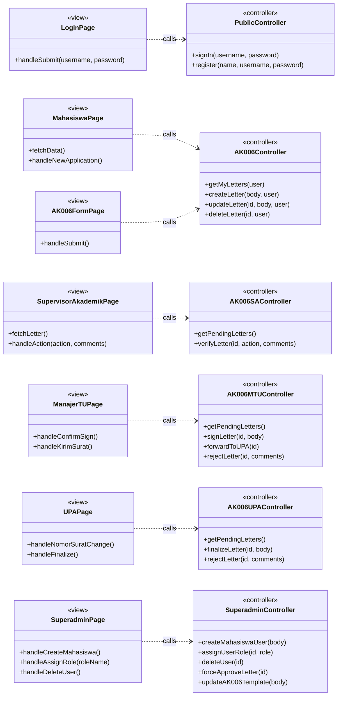
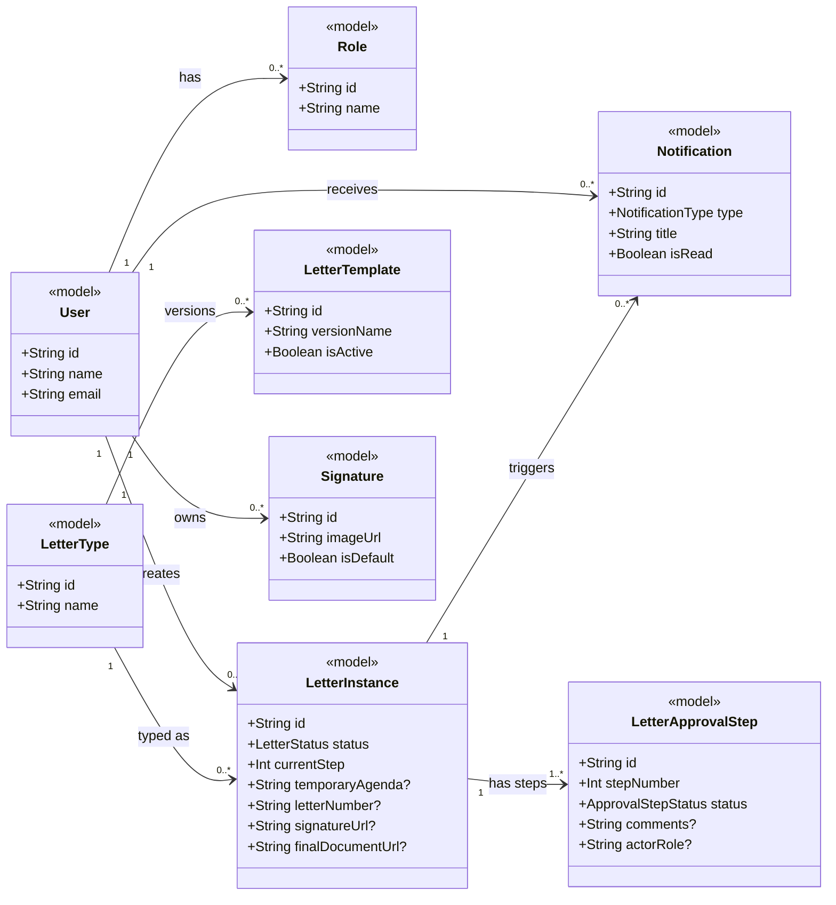
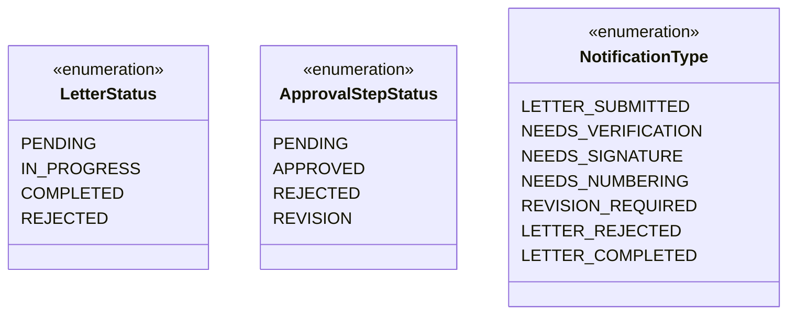

# Class Diagram — E-Office FSM UNDIP (Ringkas)

> Format: **Mermaid** · Pola **MVC** · Fokus fitur utama: workflow persetujuan surat AK006

---

## View & Controller

---

## Model

---

## Enums

---

## Ringkasan

| Layer | Komponen Utama |
|---|---|
| `<<view>>` | LoginPage, MahasiswaPage, AK006FormPage, SA/MTU/UPA/SuperadminPage |
| `<<controller>>` | PublicController, AK006Controller, AK006SAController, AK006MTUController, AK006UPAController, SuperadminController |
| `<<model>>` | User, Role, LetterInstance, LetterApprovalStep, LetterType, LetterTemplate, Signature, Notification |
