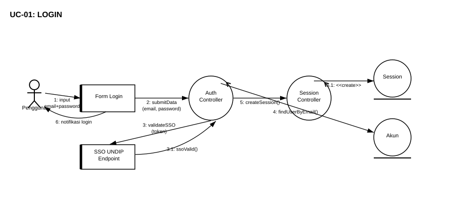
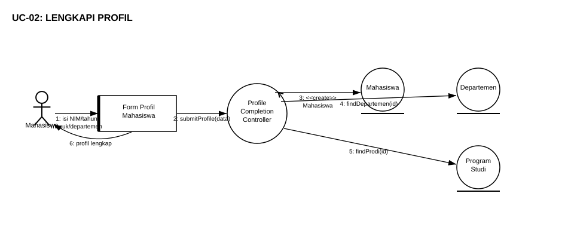
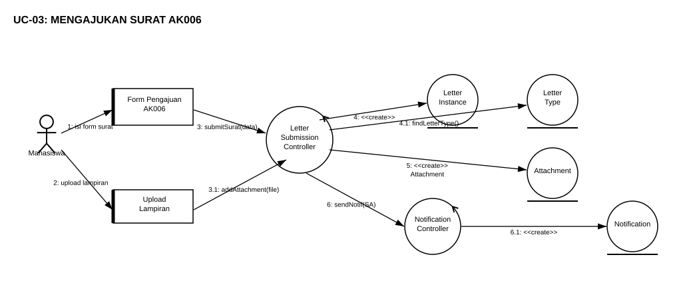
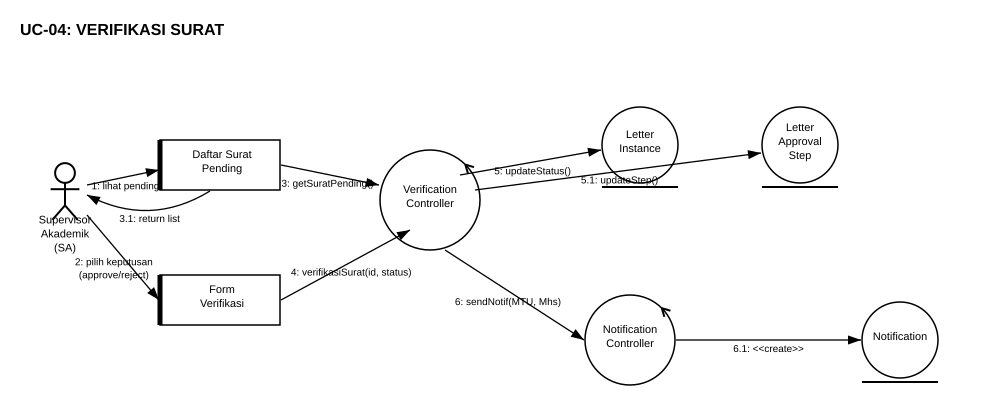
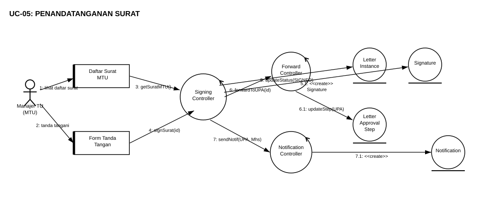
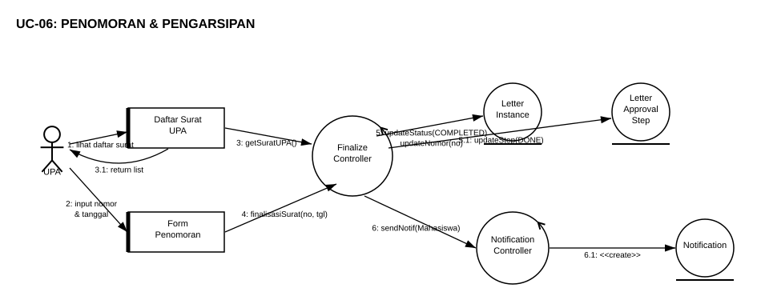
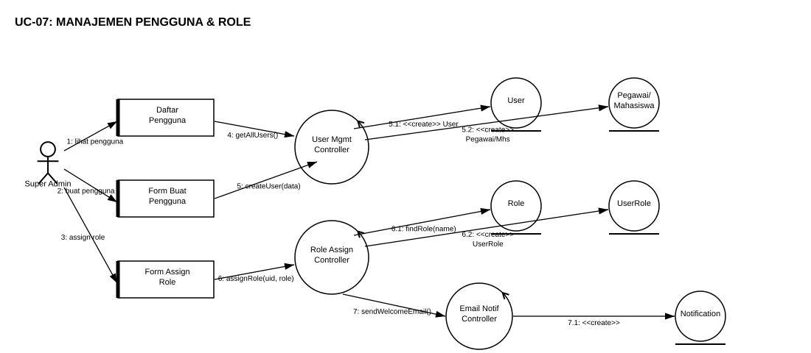

# Robustness Diagram — E-Office FSM UNDIP Tim 2

Dokumen ini memuat identifikasi objek **Entity**, **Boundary**, dan **Control** beserta diagram robustness untuk setiap use case sistem E-Office FSM UNDIP Tim 2.

---

## UC-01: LOGIN

### Identifikasi Objek UC-01

| No | Tipe | Nama Objek | Keterangan |
|----|------|-----------|------------|
| 1 | Actor | Pengguna | Semua role (Mahasiswa, SA, MTU, UPA, Super Admin) |
| 2 | Boundary | Form Login | Antarmuka input email dan password |
| 3 | Boundary | SSO UNDIP Endpoint | Layanan Single Sign-On eksternal UNDIP |
| 4 | Control | Auth Controller | Memvalidasi kredensial dan mengkoordinasikan proses login |
| 5 | Control | Session Controller | Membuat dan mengelola sesi pengguna |
| 6 | Entity | Session | Menyimpan data sesi aktif pengguna |
| 7 | Entity | Akun (User) | Menyimpan data akun pengguna di sistem |

---

## UC-02: LENGKAPI PROFIL

### Identifikasi Objek UC-02

| No | Tipe | Nama Objek | Keterangan |
|----|------|-----------|------------|
| 1 | Actor | Mahasiswa | Pengguna dengan role mahasiswa |
| 2 | Boundary | Form Profil Mahasiswa | Antarmuka pengisian NIM, tahun masuk, departemen |
| 3 | Control | Profile Completion Controller | Memproses dan menyimpan data profil mahasiswa |
| 4 | Entity | Mahasiswa | Menyimpan data profil lengkap mahasiswa |
| 5 | Entity | Departemen | Menyimpan data referensi departemen |
| 6 | Entity | Program Studi | Menyimpan data referensi program studi |

---

## UC-03: MENGAJUKAN SURAT AK006

### Identifikasi Objek UC-03

| No | Tipe | Nama Objek | Keterangan |
|----|------|-----------|------------|
| 1 | Actor | Mahasiswa | Pengguna pengaju surat |
| 2 | Boundary | Form Pengajuan AK006 | Antarmuka pengisian data surat keterangan mahasiswa |
| 3 | Boundary | Upload Lampiran | Antarmuka pengunggahan file pendukung |
| 4 | Control | Letter Submission Controller | Memproses pengajuan surat dan orkestrasi alur |
| 5 | Control | Notification Controller | Mengirimkan notifikasi ke Supervisor Akademik |
| 6 | Entity | LetterInstance | Menyimpan data instansi surat yang diajukan |
| 7 | Entity | LetterType | Menyimpan tipe/template surat AK006 |
| 8 | Entity | Attachment | Menyimpan referensi file lampiran |
| 9 | Entity | Notification | Menyimpan data notifikasi yang dikirim |

---

## UC-04: VERIFIKASI SURAT

### Identifikasi Objek UC-04

| No | Tipe | Nama Objek | Keterangan |
|----|------|-----------|------------|
| 1 | Actor | Supervisor Akademik (SA) | Pengguna dengan role verifikator akademik |
| 2 | Boundary | Daftar Surat Pending | Antarmuka daftar surat yang menunggu verifikasi |
| 3 | Boundary | Form Verifikasi | Antarmuka keputusan approve/reject/revisi |
| 4 | Control | Verification Controller | Memproses keputusan verifikasi dan memperbarui status |
| 5 | Control | Notification Controller | Mengirimkan notifikasi hasil verifikasi ke MTU dan Mahasiswa |
| 6 | Entity | LetterInstance | Menyimpan status surat yang diperbarui |
| 7 | Entity | LetterApprovalStep | Menyimpan rekam jejak langkah persetujuan |
| 8 | Entity | Notification | Menyimpan data notifikasi yang dikirim |

---

## UC-05: PENANDATANGANAN SURAT

### Identifikasi Objek UC-05

| No | Tipe | Nama Objek | Keterangan |
|----|------|-----------|------------|
| 1 | Actor | Manajer TU (MTU) | Pengguna dengan role penandatangan surat |
| 2 | Boundary | Daftar Surat MTU | Antarmuka daftar surat yang siap ditandatangani |
| 3 | Boundary | Form Tanda Tangan | Antarmuka konfirmasi penandatanganan |
| 4 | Control | Signing Controller | Memproses tanda tangan dan memperbarui status surat |
| 5 | Control | Forward Controller | Meneruskan surat ke unit UPA setelah ditandatangani |
| 6 | Control | Notification Controller | Mengirimkan notifikasi ke UPA dan Mahasiswa |
| 7 | Entity | LetterInstance | Menyimpan surat dengan status SIGNED |
| 8 | Entity | Signature | Menyimpan data tanda tangan digital |
| 9 | Entity | LetterApprovalStep | Memperbarui langkah ke UPA |
| 10 | Entity | Notification | Menyimpan data notifikasi yang dikirim |

---

## UC-06: PENOMORAN & PENGARSIPAN

### Identifikasi Objek UC-06

| No | Tipe | Nama Objek | Keterangan |
|----|------|-----------|------------|
| 1 | Actor | UPA | Unit Pelayanan Akademik, penginput nomor surat resmi |
| 2 | Boundary | Daftar Surat UPA | Antarmuka daftar surat yang menunggu penomoran |
| 3 | Boundary | Form Penomoran | Antarmuka input nomor surat dan tanggal resmi |
| 4 | Control | Finalize Controller | Memproses finalisasi, menetapkan nomor, mengubah status COMPLETED |
| 5 | Control | Notification Controller | Mengirimkan notifikasi ke Mahasiswa bahwa surat selesai |
| 6 | Entity | LetterInstance | Menyimpan surat dengan nomor resmi dan status COMPLETED |
| 7 | Entity | LetterApprovalStep | Memperbarui langkah terakhir menjadi DONE |
| 8 | Entity | Notification | Menyimpan data notifikasi yang dikirim |

---

## UC-07: MANAJEMEN PENGGUNA & ROLE

### Identifikasi Objek UC-07

| No | Tipe | Nama Objek | Keterangan |
|----|------|-----------|------------|
| 1 | Actor | Super Admin | Administrator sistem dengan akses penuh |
| 2 | Boundary | Daftar Pengguna | Antarmuka melihat seluruh pengguna terdaftar |
| 3 | Boundary | Form Buat Pengguna | Antarmuka pembuatan akun pengguna baru |
| 4 | Boundary | Form Assign Role | Antarmuka penentuan role untuk pengguna |
| 5 | Control | User Management Controller | Memproses pembuatan dan pengelolaan akun pengguna |
| 6 | Control | Role Assignment Controller | Memproses penetapan role dan sinkronisasi ke Casbin |
| 7 | Control | Email Notification Controller | Mengirimkan email welcome ke pengguna baru |
| 8 | Entity | User | Menyimpan data akun pengguna |
| 9 | Entity | Pegawai/Mahasiswa | Menyimpan data profil spesifik per jenis pengguna |
| 10 | Entity | Role | Menyimpan daftar role yang tersedia di sistem |
| 11 | Entity | UserRole | Menyimpan relasi antara pengguna dan role-nya |
| 12 | Entity | Notification | Menyimpan data notifikasi/email yang dikirim |

---

## Tabel Ringkasan

| Use Case | Nama | Actor | Boundary | Control | Entity | Total Objek |
|----------|------|-------|----------|---------|--------|-------------|
| UC-01 | Login | 1 | 2 | 2 | 2 | 7 |
| UC-02 | Lengkapi Profil | 1 | 1 | 1 | 3 | 6 |
| UC-03 | Mengajukan Surat AK006 | 1 | 2 | 2 | 4 | 9 |
| UC-04 | Verifikasi Surat | 1 | 2 | 2 | 3 | 8 |
| UC-05 | Penandatanganan Surat | 1 | 2 | 3 | 4 | 10 |
| UC-06 | Penomoran & Pengarsipan | 1 | 2 | 2 | 3 | 8 |
| UC-07 | Manajemen Pengguna & Role | 1 | 3 | 3 | 5 | 12 |
| **Total** | | **7** | **14** | **15** | **24** | **60** |

---

> Diagram dibuat menggunakan simbol UML Robustness Analysis standar (OOAD — Jacobson).
> Aturan relasi: Actor → Boundary → Control → Entity.
