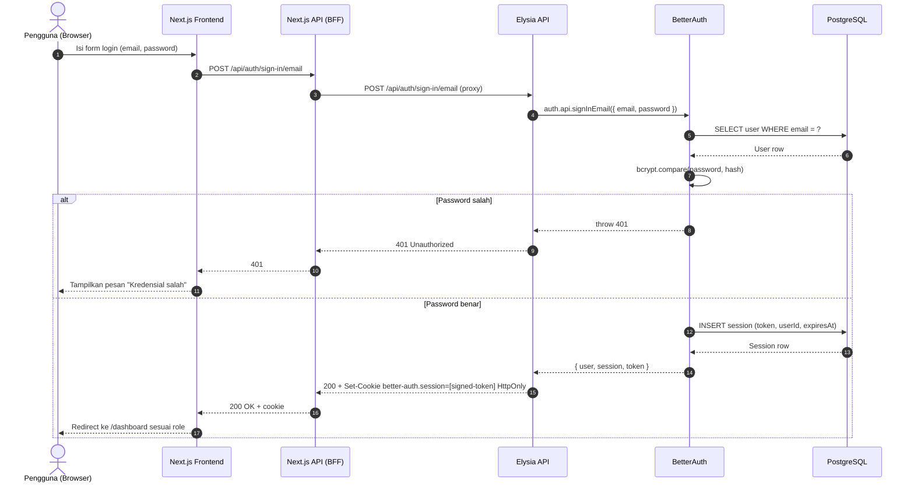
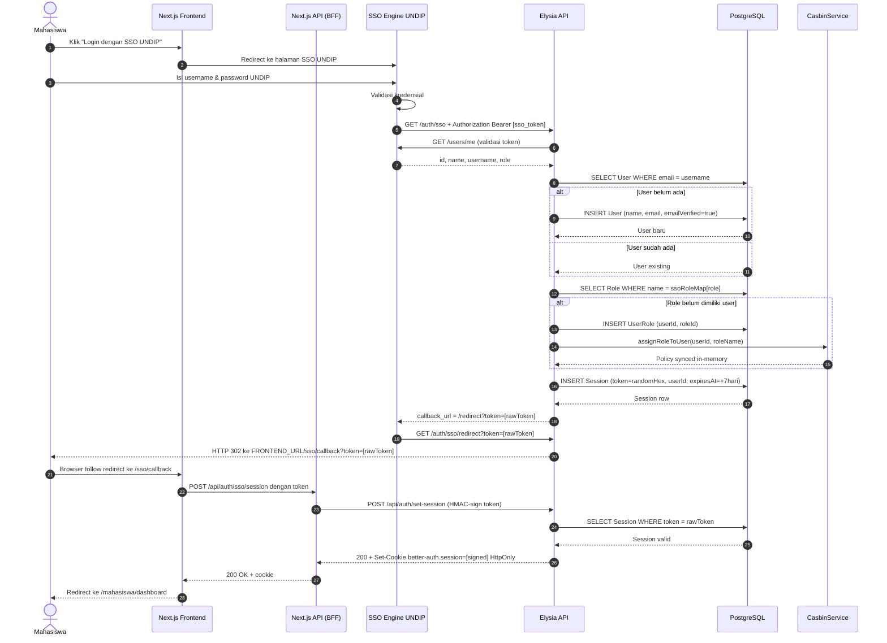
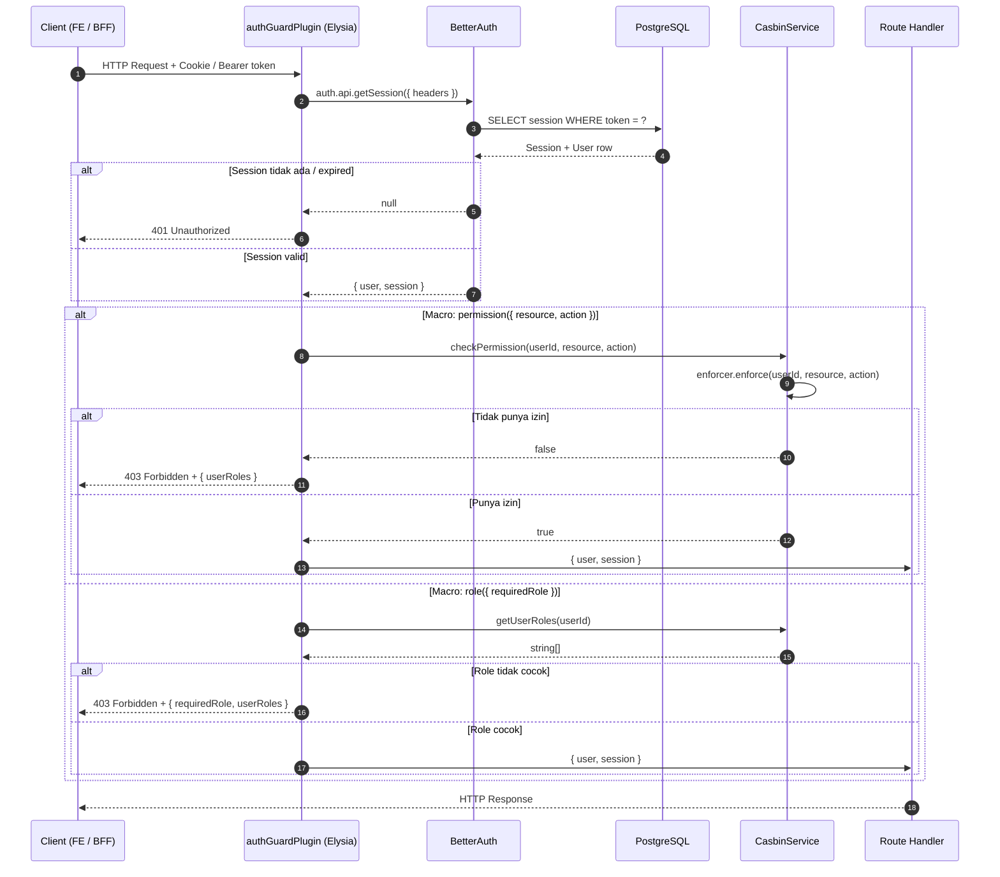
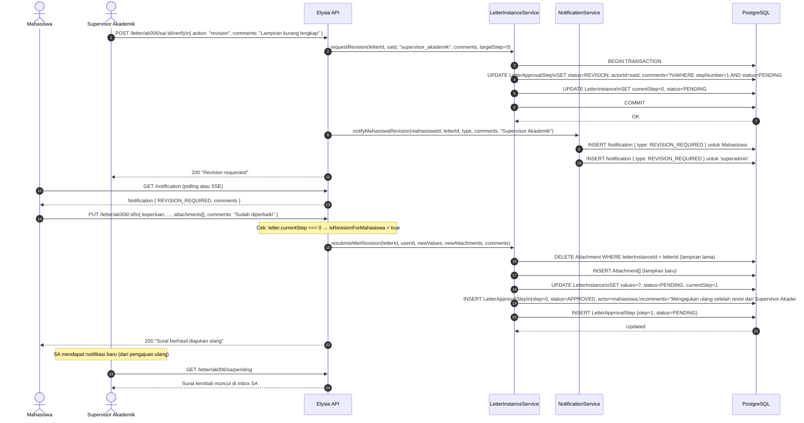
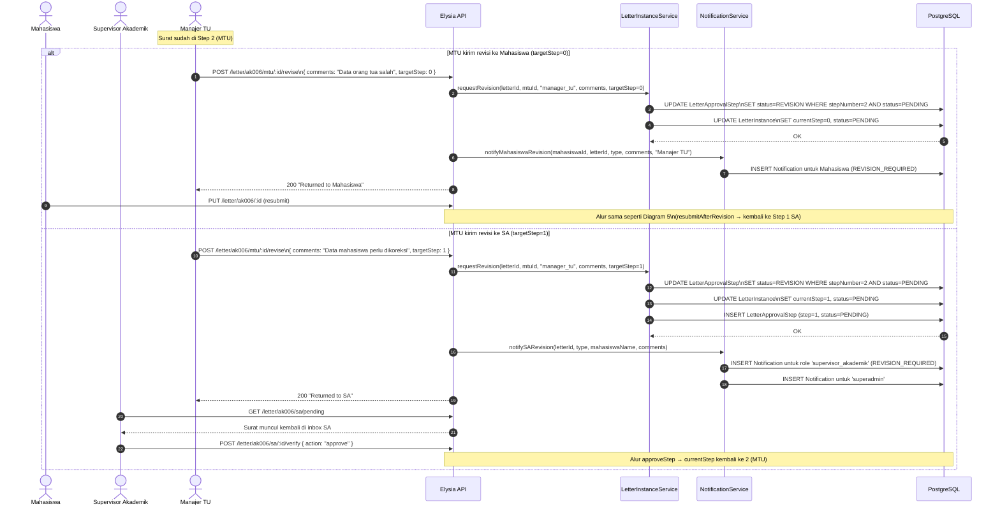
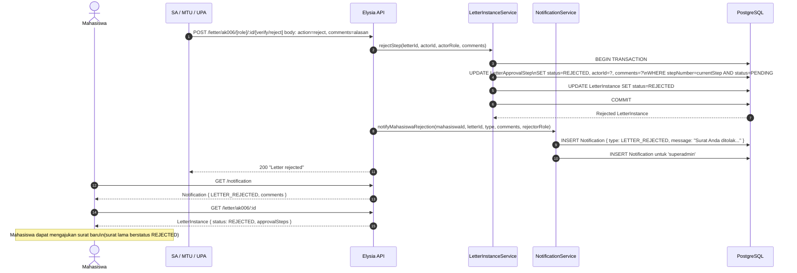
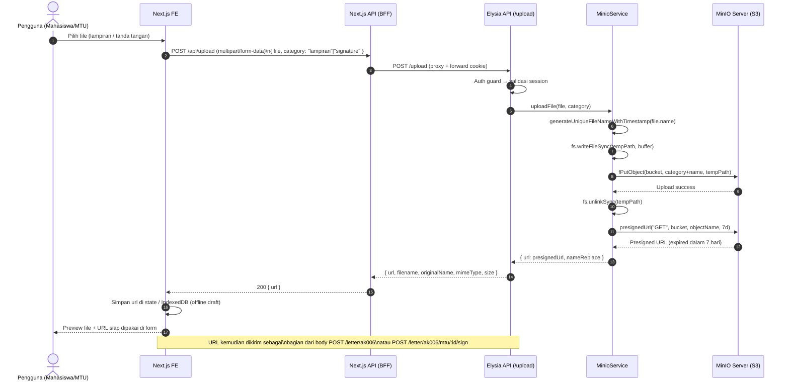
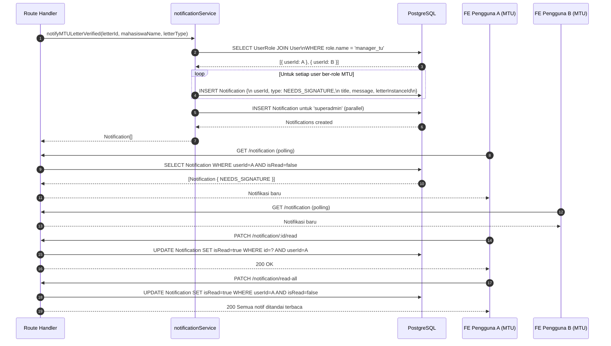
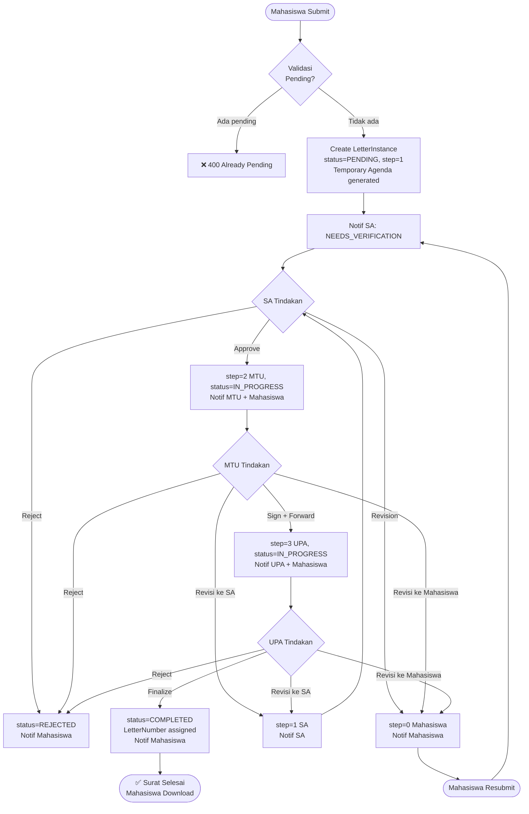

# Sequence Diagram — E-Office Monorepo (FSM UNDIP)

> Format: **Mermaid** — render di GitHub, VS Code (Mermaid Preview), Obsidian, Notion, dll.

---

## Daftar Diagram

1. [Login — Email & Password](#1-login--email--password)
2. [Login — SSO UNDIP](#2-login--sso-undip)
3. [Auth Guard (per-request)](#3-auth-guard--per-request)
4. [AK006 Happy Path — Pengajuan s.d. Selesai](#4-ak006-happy-path--pengajuan-sd-selesai)
5. [Revisi oleh SA → Mahasiswa Resubmit](#5-revisi-oleh-sa--mahasiswa-resubmit)
6. [MTU Revision → ke Mahasiswa atau SA](#6-mtu-revision--ke-mahasiswa-atau-sa)
7. [Penolakan (Reject) oleh SA / MTU / UPA](#7-penolakan-reject-oleh-sa--mtu--upa)
8. [Upload File ke MinIO](#8-upload-file-ke-minio)
9. [Notifikasi Fanout ke Role](#9-notifikasi-fanout-ke-role)

---

## 1. Login — Email & Password

---

## 2. Login — SSO UNDIP

---

## 3. Auth Guard — Per-Request

> Berlaku untuk setiap endpoint yang dilindungi (`authGuardPlugin`)

---

## 4. AK006 Happy Path — Pengajuan s.d. Selesai

```mermaid
sequenceDiagram
    autonumber
    actor Mhs as Mahasiswa
    actor SA as Supervisor Akademik
    actor MTU as Manajer TU
    actor UPA as UPA

    participant FE as Next.js FE
    participant BE as Elysia API
    participant LIS as LetterInstanceService
    participant NS as NotificationService
    participant DB as PostgreSQL

    %% ── STEP 0: Mahasiswa Submit ──
    rect rgb(232, 245, 233)
        note over Mhs,DB: TAHAP 0 — Mahasiswa Mengajukan
        Mhs->>FE: Isi form AK006 + upload lampiran
        FE->>BE: POST /letter/ak006\n{ keperluan, semester, tahunAkademik, attachments, ... }
        BE->>DB: SELECT Mahasiswa WHERE userId = user.id
        DB-->>BE: Mahasiswa data

        BE->>LIS: hasPendingLetter(userId, "AK006")
        LIS->>DB: COUNT LetterInstance WHERE status IN [PENDING, IN_PROGRESS]
        DB-->>LIS: 0 (boleh lanjut)

        BE->>DB: UPSERT LetterType WHERE name = "AK006"
        BE->>DB: SELECT LetterTemplate WHERE isActive = true (snapshot)

        BE->>LIS: create({ letterTypeId, createdById, schema, values, templateConfig, attachments })
        LIS->>LIS: generateTemporaryAgenda()\n→ "001/UN7.F8.4/AK/TBD/2025"
        LIS->>DB: INSERT LetterInstance (status=PENDING, currentStep=1)
        LIS->>DB: INSERT LetterApprovalStep (step=0, status=APPROVED, actor=mahasiswa)
        LIS->>DB: INSERT LetterApprovalStep (step=1, status=PENDING)
        LIS->>DB: INSERT Attachment[] (jika ada)
        DB-->>LIS: LetterInstance

        BE->>NS: notifySANewLetter(letterId, mahasiswaName, type)
        NS->>DB: SELECT UserRole WHERE role.name = 'supervisor_akademik'
        NS->>DB: SELECT UserRole WHERE role.name = 'superadmin'
        NS->>DB: INSERT Notification[] (NEEDS_VERIFICATION)
        BE-->>FE: 200 { success: true, data: letter }
        FE-->>Mhs: "Pengajuan berhasil dikirim"
    end

    %% ── STEP 1: SA Verifikasi ──
    rect rgb(227, 242, 253)
        note over SA,DB: TAHAP 1 — Supervisor Akademik Verifikasi
        SA->>FE: Buka inbox SA → GET /letter/ak006/sa/pending
        FE->>BE: GET /letter/ak006/sa/pending (role: supervisor_akademik)
        BE->>LIS: getPendingForStep(1, "AK006")
        LIS->>DB: SELECT LetterInstance WHERE currentStep=1 AND status IN [PENDING, IN_PROGRESS]
        DB-->>LIS: Letter[]
        BE-->>FE: Daftar surat pending
        FE-->>SA: Tampilkan daftar surat

        SA->>FE: Klik surat → verifikasi → Approve
        FE->>BE: POST /letter/ak006/sa/:id/verify { action: "approve", comments? }
        BE->>LIS: approveStep(letterId, userId, "supervisor_akademik", comments)

        LIS->>DB: BEGIN TRANSACTION
        LIS->>DB: UPDATE LetterApprovalStep SET status=APPROVED\nWHERE letterInstanceId=id AND stepNumber=1 AND status=PENDING
        LIS->>DB: UPDATE LetterInstance SET currentStep=2, status=IN_PROGRESS
        LIS->>DB: INSERT LetterApprovalStep (step=2, status=PENDING)
        LIS->>DB: COMMIT
        DB-->>LIS: Updated LetterInstance

        BE->>NS: notifyMTULetterVerified(letterId, name, type)
        NS->>DB: INSERT Notification[] untuk role 'manager_tu' + 'superadmin'
        BE->>NS: notifyMahasiswaVerified(mahasiswaId, letterId, type)
        NS->>DB: INSERT Notification untuk Mahasiswa (LETTER_VERIFIED)
        BE-->>FE: 200 "Letter forwarded to MTU"
        FE-->>SA: "Surat berhasil diverifikasi"
    end

    %% ── STEP 2a: MTU Sign ──
    rect rgb(252, 228, 236)
        note over MTU,DB: TAHAP 2a — Manajer TU Tanda Tangan
        MTU->>FE: Buka inbox → GET /letter/ak006/mtu/pending
        FE->>BE: GET (role: manager_tu)
        BE->>LIS: getPendingForStep(2, "AK006")
        DB-->>BE: Letter[] pending MTU
        FE-->>MTU: Daftar surat

        MTU->>FE: Buka surat → klik "Tanda Tangan"
        FE->>BE: POST /letter/ak006/mtu/:id/sign\n{ signatureId? | signatureUrl? }
        BE->>DB: SELECT Signature WHERE userId = MTU.id (default)
        DB-->>BE: Signature { imageUrl }
        BE->>LIS: signLetter(letterId, actorId, signatureUrl)
        LIS->>DB: UPDATE LetterInstance SET signatureUrl = ?
        DB-->>LIS: Updated
        BE-->>FE: 200 "Letter signed"
        FE-->>MTU: Preview tanda tangan muncul
    end

    %% ── STEP 2b: MTU Forward ke UPA ──
    rect rgb(252, 228, 236)
        note over MTU,DB: TAHAP 2b — MTU Teruskan ke UPA
        MTU->>FE: Klik "Teruskan ke UPA"
        FE->>BE: POST /letter/ak006/mtu/:id/forward { comments? }
        BE->>DB: CHECK signatureUrl NOT NULL
        BE->>LIS: forwardToUPA(letterId, actorId, comments)
        LIS->>LIS: approveStep(letterId, actorId, "manager_tu")

        LIS->>DB: BEGIN TRANSACTION
        LIS->>DB: UPDATE LetterApprovalStep SET status=APPROVED WHERE stepNumber=2
        LIS->>DB: UPDATE LetterInstance SET currentStep=3, status=IN_PROGRESS
        LIS->>DB: INSERT LetterApprovalStep (step=3, status=PENDING)
        LIS->>DB: COMMIT

        BE->>NS: notifyUPALetterSigned(letterId, name, type)
        NS->>DB: INSERT Notification[] untuk role 'upa' + 'superadmin'
        BE->>NS: notifyMahasiswaSigned(mahasiswaId, letterId, type)
        NS->>DB: INSERT Notification untuk Mahasiswa (LETTER_SIGNED)
        BE-->>FE: 200 "Forwarded to UPA"
        FE-->>MTU: "Surat diteruskan ke UPA"
    end

    %% ── STEP 3: UPA Finalisasi ──
    rect rgb(255, 253, 231)
        note over UPA,DB: TAHAP 3 — UPA Penomoran & Arsip
        UPA->>FE: Buka inbox → GET /letter/ak006/upa/pending
        FE->>BE: GET (role: upa)
        BE->>LIS: getPendingForStep(3, "AK006")
        DB-->>BE: Letter[] pending UPA
        FE-->>UPA: Daftar surat

        UPA->>FE: Klik surat → isi nomor surat → Finalisasi
        FE->>BE: POST /letter/ak006/upa/:id/finalize\n{ letterNumber?, letterDate?, comments? }
        BE->>LIS: finalizeLetter(letterId, actorId, { letterNumber, letterDate })
        LIS->>LIS: generateLetterNumber("AK006")\n→ "001/UN7.F8.4/AK/VI/2025" (jika tidak di-override)
        LIS->>DB: UPDATE LetterInstance SET letterNumber=?, archivedAt=?, archivedById=?
        LIS->>LIS: approveStep(letterId, actorId, "upa")
        LIS->>DB: BEGIN TRANSACTION
        LIS->>DB: UPDATE LetterApprovalStep SET status=APPROVED WHERE stepNumber=3
        LIS->>DB: UPDATE LetterInstance SET status=COMPLETED
        LIS->>DB: COMMIT
        DB-->>LIS: Completed LetterInstance

        BE->>NS: notifyMahasiswaCompleted(mahasiswaId, letterId, type)
        NS->>DB: INSERT Notification (LETTER_COMPLETED) untuk Mahasiswa
        NS->>DB: INSERT Notification untuk 'superadmin'
        BE-->>FE: 200 "Letter completed"
        FE-->>UPA: "Surat berhasil diterbitkan"

        Mhs->>FE: Lihat notif → Download surat
        FE->>BE: GET /letter/ak006/:id
        BE->>LIS: getById(letterId)
        DB-->>BE: LetterInstance { status: COMPLETED, letterNumber, finalDocumentUrl }
        BE-->>FE: Data surat lengkap
        FE-->>Mhs: Tampilkan surat + tombol unduh
    end
```

---

## 5. Revisi oleh SA → Mahasiswa Resubmit

---

## 6. MTU Revision — ke Mahasiswa atau SA

---

## 7. Penolakan (Reject) oleh SA / MTU / UPA

---

## 8. Upload File ke MinIO

---

## 9. Notifikasi Fanout ke Role

> Dipakai saat SA approve → perlu notif ke semua user ber-role `manager_tu`

---

## Ringkasan Alur Utama

