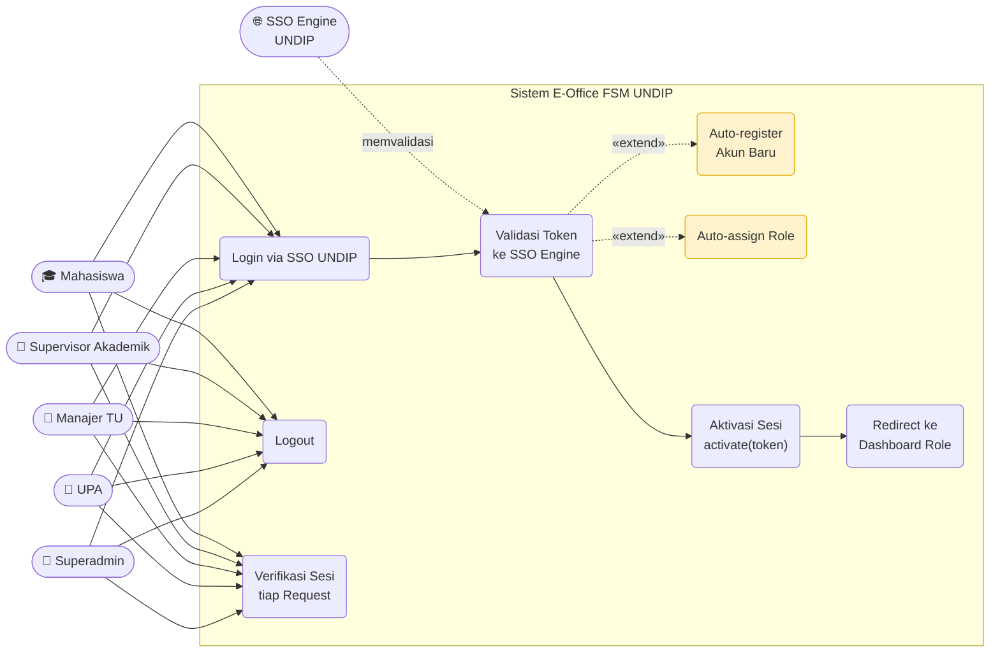
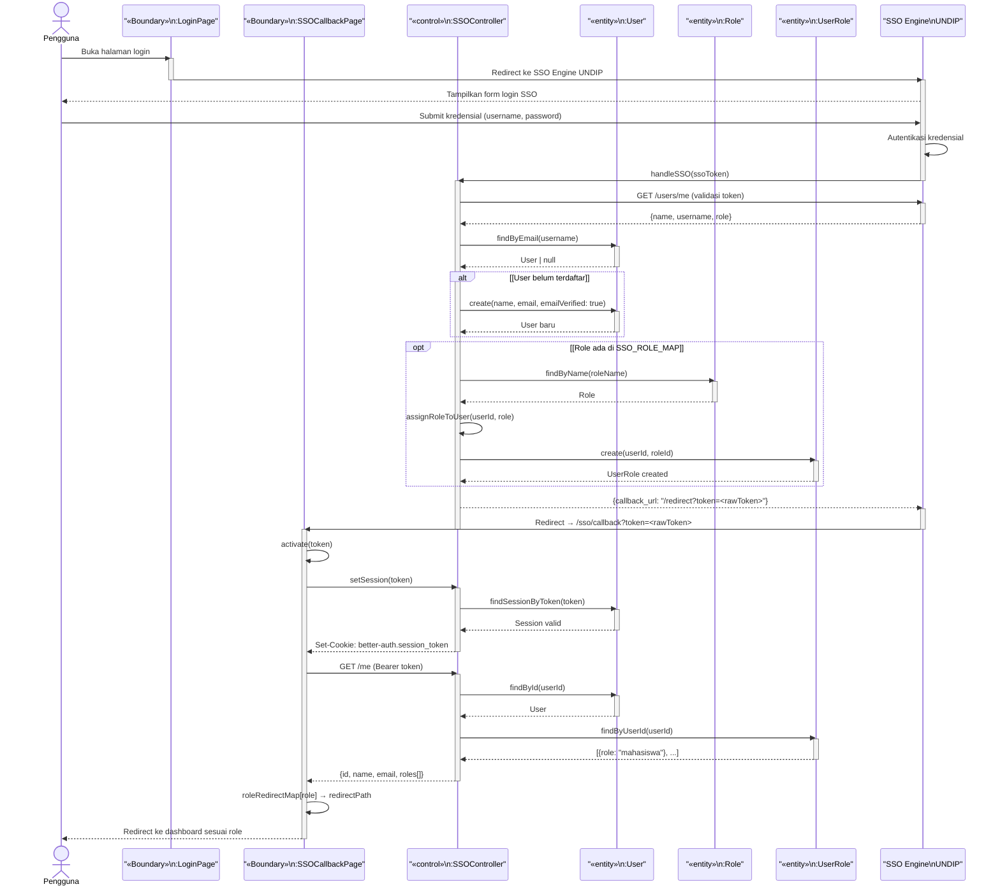

# Use Case & Sequence Diagram — Autentikasi SSO (MVC)

> Format: **Mermaid** · Pola **MVC** · nama kelas & metode sesuai `classdiagram4.md`

---

## Daftar Isi

1. [Use Case Diagram — Autentikasi Semua Pengguna](#1-use-case-diagram--autentikasi-semua-pengguna)
2. [Sequence Diagram — Login via SSO UNDIP](#2-sequence-diagram--login-via-sso-undip)

---

## 1. Use Case Diagram — Autentikasi Semua Pengguna

| Aktor | Metode Login |
|---|---|
| Mahasiswa | SSO UNDIP |
| Supervisor Akademik | SSO UNDIP |
| Manajer TU | SSO UNDIP |
| UPA | SSO UNDIP |
| Superadmin | SSO UNDIP |
| SSO Engine UNDIP | Sistem eksternal — memvalidasi kredensial |

---

## 2. Sequence Diagram — Login via SSO UNDIP

