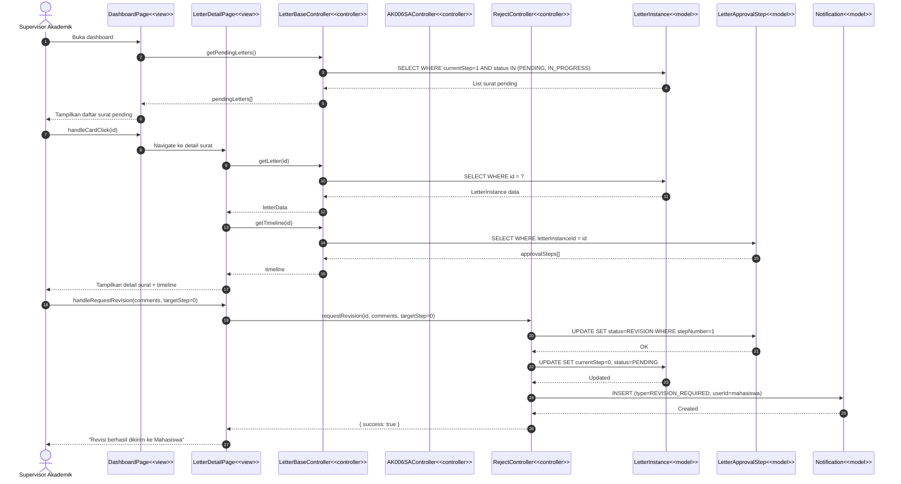
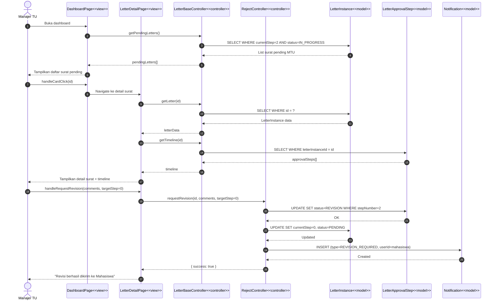
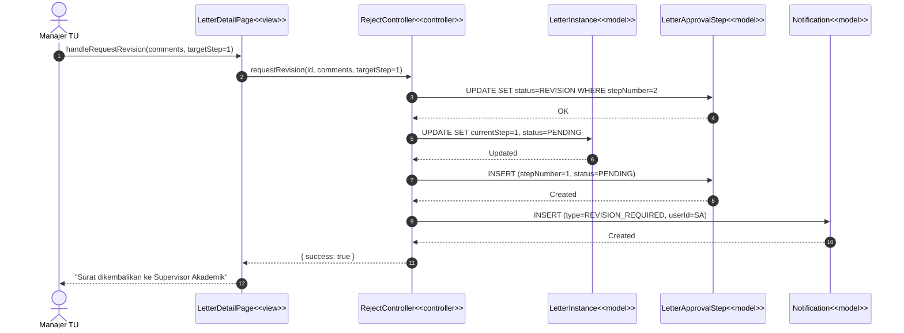
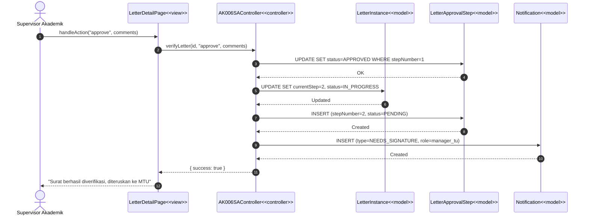
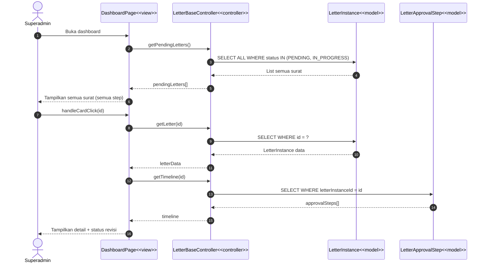
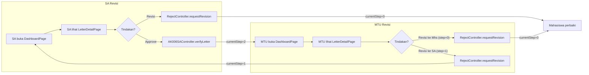

# Sequence Diagram — SA, MTU Memberikan / Merevisi Surat

> Format: **Mermaid** · Pola **MVC (Model-View-Controller)**
>
> Sumber: [`classdiagram5.md`](file:///home/tim2/e-office-monorepo/docs/classdiagram5.md)

---

## Komponen yang Terlibat

| Layer | Komponen | Stereotype |
|---|---|---|
| **View (Boundary)** | `DashboardPage`, `LetterDetailPage` | `<<view>>` |
| **Controller** | `LetterBaseController`, `AK006SAController`, `AK006MTUController`, `RejectController` | `<<controller>>` |
| **Model (Entity)** | `LetterInstance`, `LetterApprovalStep`, `Signature`, `Notification` | `<<model>>` |

---

## 1. SA Memberikan Revisi Surat ke Mahasiswa (Alur Utama)

> SA membuka dashboard, melihat surat pending, lalu meminta revisi ke mahasiswa.

---

## 2. MTU Memberikan Revisi Surat ke Mahasiswa (Alur Utama)

> MTU membuka dashboard, melihat surat pending di step 2, lalu meminta revisi ke mahasiswa.

---

## 3. MTU Memberikan Revisi Surat ke SA (Alur Utama)

> MTU mengembalikan surat ke SA untuk dikoreksi ulang.

---

## 4. SA Memberikan Persetujuan (Approve) Surat (Alur Utama)

> SA menyetujui surat dan meneruskan ke MTU — sebagai pembanding alur revisi.

---

## 5. Superadmin — Monitoring Revisi (Ringkas)

> Superadmin hanya memonitor proses melalui dashboard. Alur minimal.

---

## Ringkasan Alur Revisi

---

## Catatan

- Semua nama method (`getPendingLetters`, `getLetter`, `getTimeline`, `requestRevision`, `verifyLetter`, `handleRequestRevision`, `handleAction`, `handleCardClick`) **diambil langsung** dari [classdiagram5.md](file:///home/tim2/e-office-monorepo/docs/classdiagram5.md).
- **Boundary → Controller → Entity** mengikuti aturan MVC/BCE.
- Panah solid (`->>`) = call/request, panah putus-putus (`-->>`) = return/response.
- Superadmin hanya ditampilkan sebagai monitoring (diagram 5), sesuai permintaan "dikit aja".
