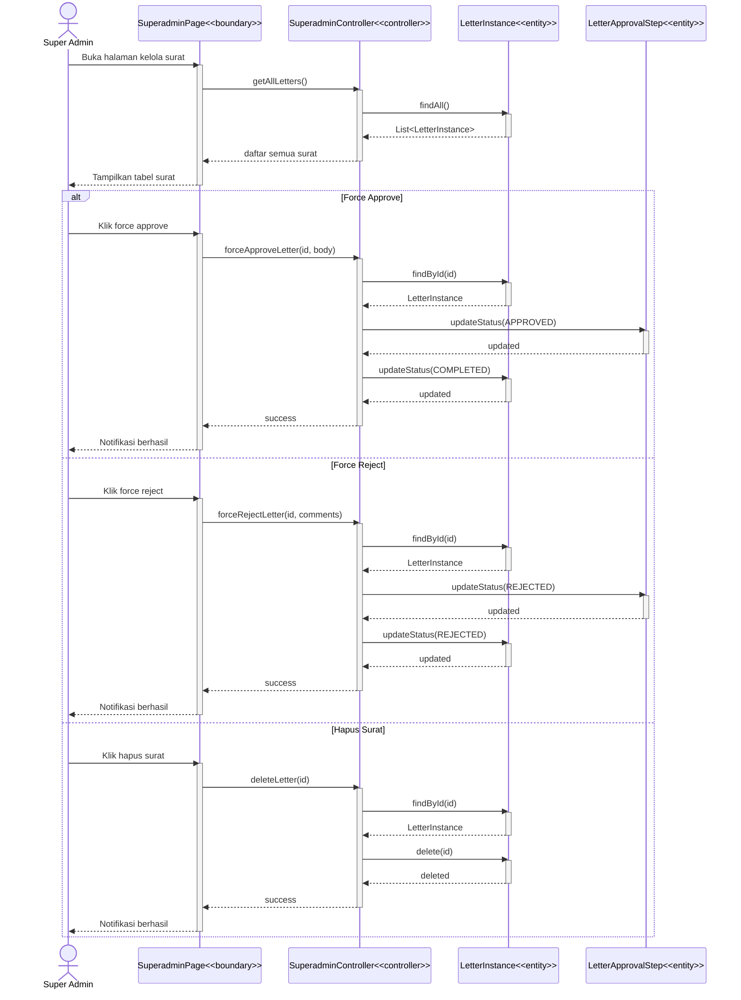

# Sequence Diagram — Super Admin Mengelola Semua Surat

> Use Case: **Super Admin Mengelola Semua Surat**
> Pola: **MVC (Boundary → Controller → Entity)**
> Sumber method: Class Diagram E-Office Monorepo

---

