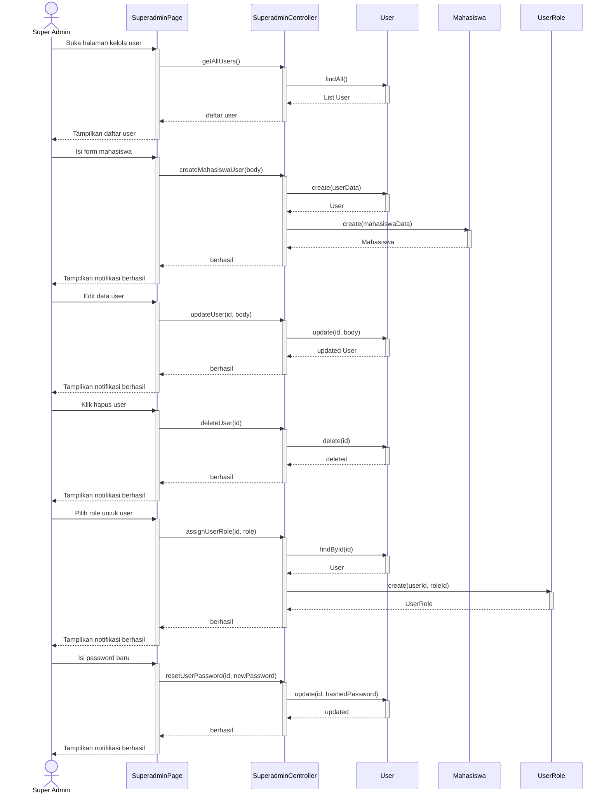

# Sequence Diagram — SuperAdmin Mengelola Master Data

> Pola: **MVC (Boundary → Controller → Entity)**

---

```mermaid
sequenceDiagram
    actor SA as Super Admin
    participant B as SuperadminPage
    participant C as SuperadminController
    participant E1 as User
    participant E2 as Mahasiswa
    participant E3 as UserRole

    %% Lihat Semua User
    SA ->> B: Buka halaman kelola user
    activate B
    B ->> C: getAllUsers()
    activate C
    C ->> E1: findAll()
    activate E1
    E1 -->> C: List User
    deactivate E1
    C -->> B: daftar user
    deactivate C
    B -->> SA: Tampilkan daftar user
    deactivate B

    %% Buat Akun Mahasiswa
    SA ->> B: Isi form mahasiswa
    activate B
    B ->> C: createMahasiswaUser(body)
    activate C
    C ->> E1: create(userData)
    activate E1
    E1 -->> C: User
    deactivate E1
    C ->> E2: create(mahasiswaData)
    activate E2
    E2 -->> C: Mahasiswa
    deactivate E2
    C -->> B: berhasil
    deactivate C
    B -->> SA: Tampilkan notifikasi berhasil
    deactivate B

    %% Update User
    SA ->> B: Edit data user
    activate B
    B ->> C: updateUser(id, body)
    activate C
    C ->> E1: update(id, body)
    activate E1
    E1 -->> C: updated User
    deactivate E1
    C -->> B: berhasil
    deactivate C
    B -->> SA: Tampilkan notifikasi berhasil
    deactivate B

    %% Hapus User
    SA ->> B: Klik hapus user
    activate B
    B ->> C: deleteUser(id)
    activate C
    C ->> E1: delete(id)
    activate E1
    E1 -->> C: deleted
    deactivate E1
    C -->> B: berhasil
    deactivate C
    B -->> SA: Tampilkan notifikasi berhasil
    deactivate B

    %% Assign Role
    SA ->> B: Pilih role untuk user
    activate B
    B ->> C: assignUserRole(id, role)
    activate C
    C ->> E1: findById(id)
    activate E1
    E1 -->> C: User
    deactivate E1
    C ->> E3: create(userId, roleId)
    activate E3
    E3 -->> C: UserRole
    deactivate E3
    C -->> B: berhasil
    deactivate C
    B -->> SA: Tampilkan notifikasi berhasil
    deactivate B

    %% Reset Password
    SA ->> B: Isi password baru
    activate B
    B ->> C: resetUserPassword(id, newPassword)
    activate C
    C ->> E1: update(id, hashedPassword)
    activate E1
    E1 -->> C: updated
    deactivate E1
    C -->> B: berhasil
    deactivate C
    B -->> SA: Tampilkan notifikasi berhasil
    deactivate B
```
