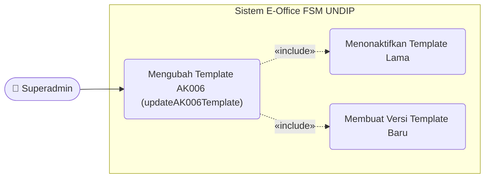
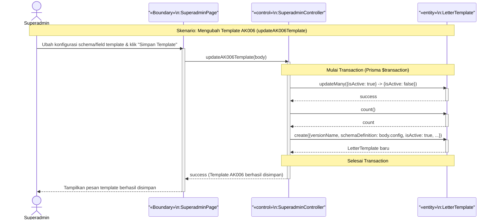

# Use Case & Sequence Diagram — Super Admin Mengubah Template (MVC)

> Format: **Mermaid** · Pola **MVC** · nama kelas & metode sesuai `classdiagram4.md`

---

## Daftar Isi

1. [Use Case Diagram — Kelola Template oleh Superadmin](#1-use-case-diagram--kelola-template-oleh-superadmin)
2. [Sequence Diagram — Super Admin Mengubah Template](#2-sequence-diagram--super-admin-mengubah-template)

---

## 1. Use Case Diagram — Kelola Template oleh Superadmin

---

## 2. Sequence Diagram — Super Admin Mengubah Template

